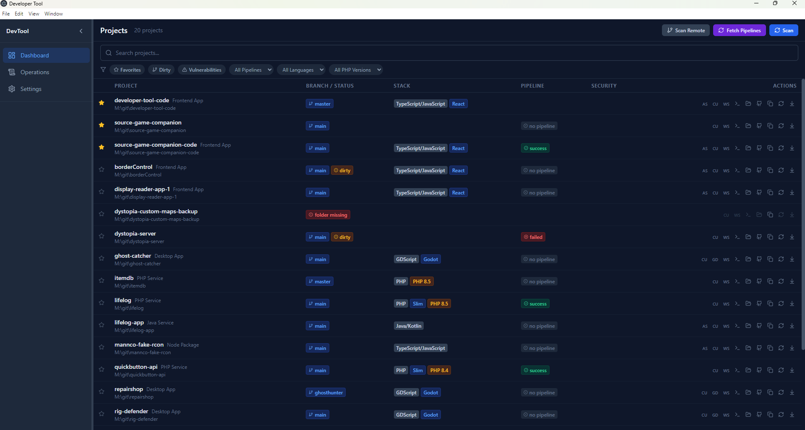
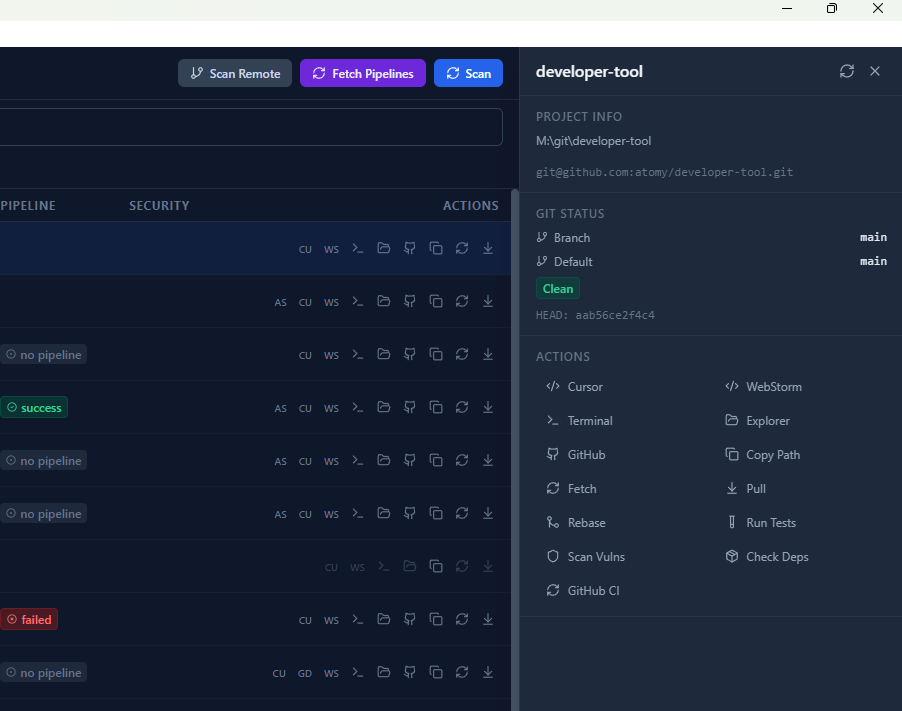
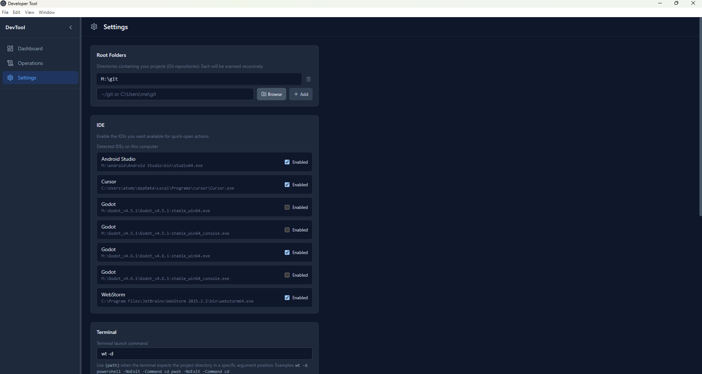
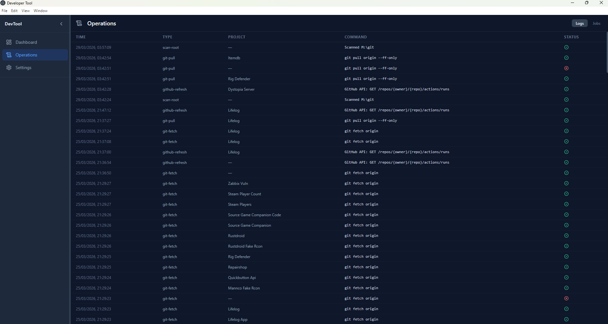

# Developer Tool

`Developer Tool` is a local-first desktop dashboard for developers managing many Git repositories.

It helps you answer a few practical questions fast:

- Which repos are dirty or behind?
- Which projects have failing pipelines?
- Which dependencies or security issues need attention?
- Which repo should I open next?

## What It Does

- Recursively discovers repositories from one or more root folders
- Shows branch, dirty state, ahead/behind, and remote health
- Surfaces pipeline status for GitHub and GitLab projects
- Detects useful project metadata like language and framework hints
- Supports favorites, filters, search, and saved views
- Opens repos in your IDE, terminal, file explorer, or browser
- Runs background tasks such as fetch, pull, scans, and test commands

## Why Use It

Instead of jumping between terminals, folders, CI pages, and browser tabs, you get one place to scan your local repo fleet and act on what matters.

## Configuration

Most setup happens in the app settings, including scan roots, IDE integrations, terminal commands, pull behavior, and optional GitHub or GitLab access.

For credentials and service endpoints, prefer environment variables:

- `DEVELOPER_TOOL_GITLAB_BASE_URL`
- `DEVELOPER_TOOL_GITLAB_TOKEN`
- `DEVELOPER_TOOL_GITHUB_TOKEN`

## Screenshots

### Project overview

### Project details

### Settings dialog

### Backend operations backlog

## In One Line

`Developer Tool` gives you a fast, local overview of repository health so you can triage, open, and maintain projects with less friction.
